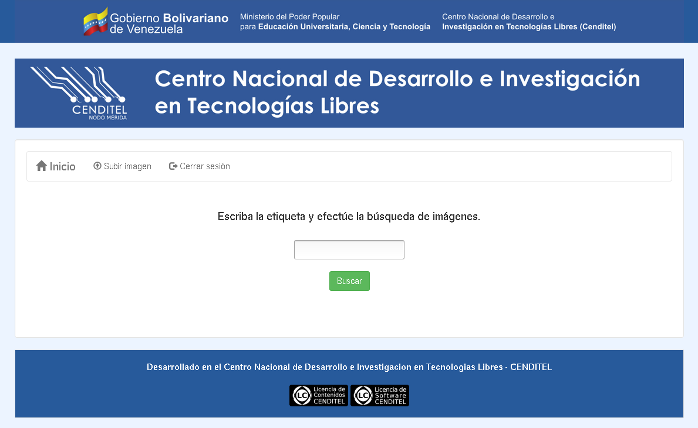

# Gestor de imágenes que permite subir recuros digitales a un servidor y luego listarlos para descargarlos.

Creado por dM

## Paquetes requeridos

De GNU/Linux Debian
```
sqlite3
```

De Python
```
Django==1.8.8
Python==2.7
```

## Instalación de paquetes para crear entornos virtuales
```
# apt-get install install python-setuptools python-dev

# apt-get install python-virtualenv virtualenvwrapper
```
## Crear un entorno virtual de python
```
$ virtualenv mi_env

$ source mi_env/bin/activate
```
## Instalación de requerimientos del proyecto
```
$ pip install -r gestor_imagenes/requirements.txt 
```
## Probar el proyecto
```
$ cd gestor_imagenes

$ cp gestor_imagenes/settings.py_example gestor_imagenes/settings.py

$ python manage.py makemigrations registro

$ python manage.py migrate

$ python manage.py createsuperuser

$ python manage.py runserver

## Capturas

